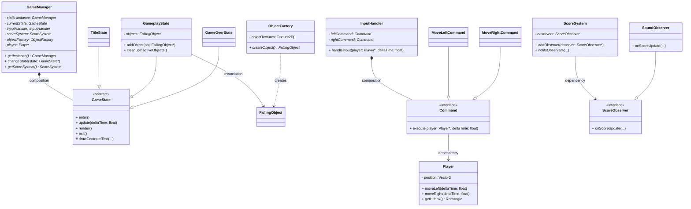

# Collect D'Gems 💎

A simple 2D arcade game where players control a mining cart to collect falling gems while avoiding dynamite. Built with C++ and Raylib as a final project for Design Pattern Programming course.


## 📋 Table of Contents

- [Overview](#overview)
- [Gameplay](#gameplay)
- [Design Patterns](#design-patterns)
- [Installation](#installation)
- [Controls](#controls)
- [Scoring System](#scoring-system)
- [Project Structure](#project-structure)
- [Authors](#authors)
- [License](#license)

## 🎮 Overview

**Collect D'Gems** is a 2D arcade-style game where the objective is to collect as many gems as possible using a mining cart. Various types of gems fall from the top of the screen, each with different point values and spawn rates. Watch out for dynamite - catching it will end your game!

## 🕹️ Gameplay

### Objective
Collect as many gems as possible to achieve the highest score while avoiding dynamite.

### Game Features
- Multiple gem types with varying rarities and point values
- Dynamic difficulty through randomized spawn rates
- Score tracking system with audio feedback
- Simple and intuitive controls
- Retro arcade-style graphics

## 🏗️ Design Patterns

This project implements five classic design patterns to demonstrate software engineering best practices:

### 1. **Singleton Pattern** - GameManager
- Ensures a single instance of the game manager exists
- Provides global access point to game state and systems
- Manages game lifecycle and component coordination

### 2. **State Pattern** - GameState
- Encapsulates game states: Title Screen, Gameplay, and Game Over
- Allows clean state transitions without complex conditionals
- Each state handles its own rendering and update logic

### 3. **Command Pattern** - InputHandler
- Encapsulates player actions (move left/right) as command objects
- Decouples input handling from player movement logic
- Enables easy extension of control schemes

### 4. **Factory Pattern** - ObjectFactory
- Creates falling objects (gems and dynamite) with random properties
- Centralizes object creation logic
- Simplifies adding new object types

### 5. **Observer Pattern** - ScoreSystem
- Notifies observers (like sound system) when score changes
- Decouples score tracking from audio feedback
- Supports multiple observers for extensibility

## 🎯 UML Class Diagram



## 🎮 Controls

| Key | Action |
|-----|--------|
| `←` / `A` | Move cart left |
| `→` / `D` | Move cart right |
| `ENTER` | Start game / Play again |
| `ESC` | Exit game |

## 💎 Scoring System

| Object | Points | Spawn Rate |
|--------|--------|------------|
| 💎 Diamond | 15 | 5% |
| 💍 Ruby | 12 | 8% |
| 🔮 Amethyst | 10 | 12% |
| 🥇 Gold Bar | 8 | 25% |
| 🥈 Silver Bar | 5 | 30% |
| 💣 Dynamite | Game Over | 20% |


## 📁 Project Structure

```
collectdgems/
├── src/
│   ├── main.cpp
│   ├── GameManager.h/cpp
│   ├── GameState.h/cpp
│   ├── InputHandler.h/cpp
│   ├── ObjectFactory.h/cpp
│   ├── ScoreSystem.h/cpp
│   ├── Player.h/cpp
│   └── FallingObject.h/cpp
├── assets/
│   ├── textures/
│   └── sounds/
├── CollectD'Gems.gif
└── README.md
```

## 👥 Authors

- **Yoga Sandy** - 5223600023
- **Samudero Dirgantoro** - 5223600016

## 📚 Course Information

**Course:** Design Pattern Programming  
**Institution:** Electronic Engineering Polytechnic Institute of Surabaya  
**Academic Year:** 2025

## 📝 License

This project is created for educational purposes as part of a Design Pattern Programming course assignment.
